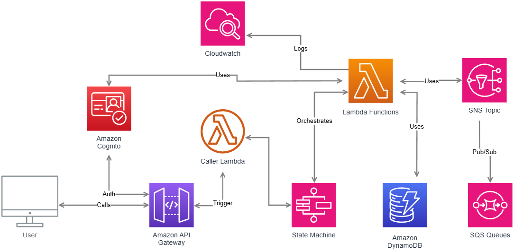

# GoOrder - Order Processing Implementation

This is a simple serverless backend for processing orders. It's built with **AWS Lambda**, **Step Functions**, **SNS**, and **SQS**, and uses **Amazon Cognito** for login. The API is exposed through **HTTP API Gateway** and secured with JWT.

I built this project to learn about **orchestration** with Step Functions and **event-driven** patterns using SNS and SQS.

---

## Features

- Secure API access with **JWT** tokens via **Cognito**
- Order processing orchestration via **Step Functions**
- Event-driven communication using **SNS** and **SQS**
- Serverless architecture- no servers to manage
- IaC with **Terraform**
- Easily extensible for new workflows and services

---

# Simplified Diagram

